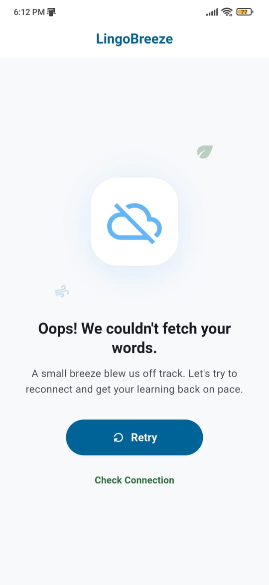
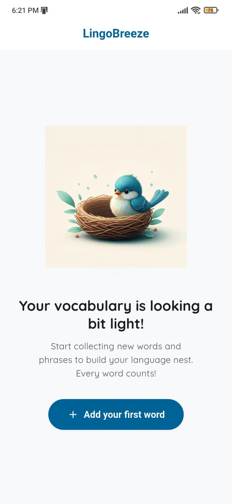
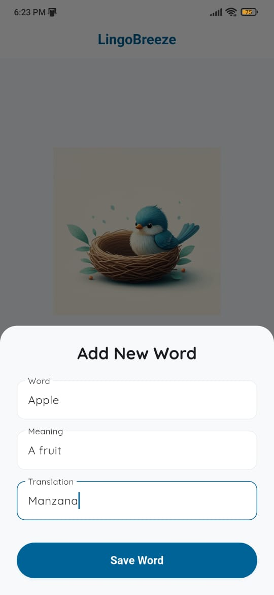
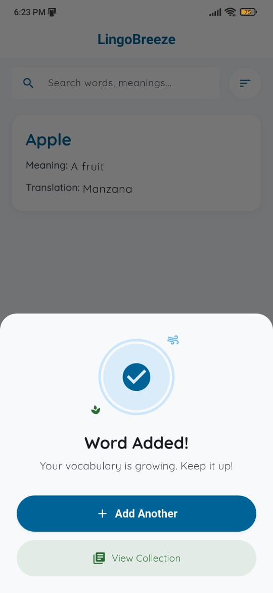
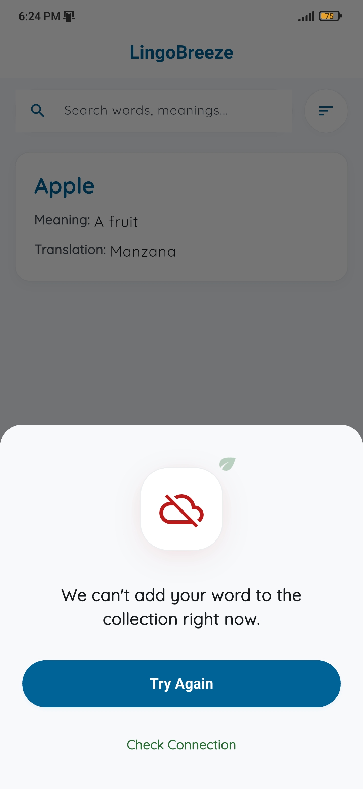
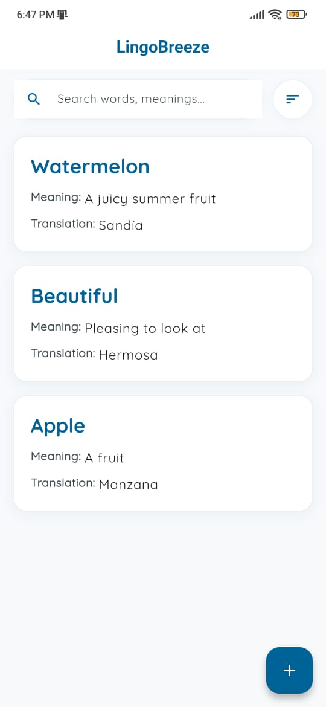

# 🌬️ LingoBreeze — My Vocabulary

A premium, highly aesthetic language-learning vocabulary companion built with **Flutter (Clean Architecture + Riverpod)**, **Node.js (Express)**, and **Firebase Cloud Firestore**.

LingoBreeze allows users to easily save vocabulary words they want to learn, translation references, and definitions, rendering them in a beautiful, glassmorphic obsidian dashboard with smooth animations.

---

## 📸 Screenshots

| Error State | Empty State | Add Word Form |
|:---:|:---:|:---:|
|  |  |  |

| Success State | Error State | Vocabulary List |
|:---:|:---:|:---:|
|  |  |  |

---

## 🌟 Key Features

### 📱 Flutter Client
- **Breezy Light Theme & Quicksand Typography**: A bright, welcoming layout featuring comfortable pastel tones, primary blue accents (`#006398`), and the Quicksand font.
- **Animated Empty State**: Displays a custom bird and nest illustration with a native floating animation when the vocabulary list is empty.
- **Reactive Search & Sort**: Instant in-memory filtering by word, meaning, or translation, combined with custom sorting (Newest Added, Oldest Added, A-Z, Z-A).
- **Morphing Bottom Sheets**: The "Add Word" flow transitions smoothly in-place between form entry, a checkmark success screen, and a diagnostic error screen.
- **Clean Architecture**: Built on strict separation of concerns (Domain, Data, Presentation layers) to ensure code testability and clean Riverpod notifier flows.

### 🛡️ Node.js Express Backend
- **Dual-Mode Firebase Integration**:
  - **Local Emulator Mode**: Run offline without setting up cloud credentials (using the Firestore Emulator).
  - **Live Cloud Firestore**: Connect directly to Google Cloud using a service account key.
- **Robust Middleware**: Structured with global error handler middleware and standard JSON routing.

---

## 🏗️ Architecture Design

The frontend implements **Clean Architecture** combined with **Feature-Driven Structuring**:

```mermaid
graph TD
    subgraph Presentation ["Presentation Layer (UI & Controllers)"]
        UI[Widgets / Screen] -->|Reads / Watches| Provider[Riverpod AsyncNotifier]
        Provider -->|Updates| UI
    end

    subgraph Domain ["Domain Layer (Business Logic)"]
        Provider -->|Invokes| UseCase[Get/Add Words Use Cases]
        UseCase -->|Defines contract| RepoInterface[Repository Interface]
    end

    subgraph Data ["Data Layer (Implementation)"]
        RepoImpl[Repository Implementation] -.->|Implements| RepoInterface
        RepoImpl -->|Calls| DataSource[HTTP Data Source]
        DataSource -->|Sends Request| RemoteAPI[Express API]
    end
    
    style Presentation fill:#1E1E2E,stroke:#89B4FA,stroke-width:2px;
    style Domain fill:#181825,stroke:#A6E3A1,stroke-width:2px;
    style Data fill:#1E1E2E,stroke:#F38BA8,stroke-width:2px;
```



---

## 📁 Repository Directory Structure

```text
LingoBreeze/
├── backend/                         # Node.js + Express + Firestore Backend
│   ├── src/
│   │   ├── config/                  # Firebase & environment config
│   │   ├── middleware/              # Error handling middlewares
│   │   ├── routes/                  # Express routes (GET/POST /words)
│   │   └── index.js                 # Entry point
│   ├── .env.example                 # Template for environment variables
│   ├── .env                         # Local runtime environment
│   └── serviceAccountKey.json       # Live Firebase Service Account Key (Git Ignored)
│
├── flutter-app/                     # Flutter Mobile Application
│   ├── lib/
│   │   ├── core/                    # App constants, network clients, themes
│   │   └── features/
│   │       └── vocabulary/          # "My Vocabulary" Feature Component
│   │           ├── data/            # Models, DTOs, and Data Sources
│   │           ├── domain/          # Entities, Repositories, and Use Cases
│   │           └── presentation/    # Riverpod providers, Screens, and Widgets
```

---

## 🚀 Getting Started

### Prerequisites
- [Flutter SDK 3.x+](https://docs.flutter.dev/get-started/install)
- [Node.js 18+](https://nodejs.org/)
- A Firebase / Google Cloud project (for Live Database mode) or Java runtime installed (for Local Emulator mode).

---

### 1. Backend Setup & Run

Navigate to the `backend` directory:
```bash
cd backend
npm install
```

Copy the environment file:
```bash
cp .env.example .env
```

#### Choose Your Database Target:

##### Option A: Live Firebase Firestore (Standard)
1. Generate a Service Account Key in the Firebase Console:
   - Go to **Project Settings** > **Service Accounts**.
   - Click **Generate New Private Key** and download the JSON.
2. Save it as `backend/serviceAccountKey.json`.
3. In your `.env` file, specify:
   ```env
   PORT=3000
   NODE_ENV=development
   FIREBASE_SERVICE_ACCOUNT_KEY=./serviceAccountKey.json
   ```
4. Start the backend:
   ```bash
   npm run dev
   ```

##### Option B: Local Firestore Emulator (Offline / Testing)
1. Set the emulator host environment variable in your terminal:
   - **Windows PowerShell**:
     ```powershell
     $env:FIRESTORE_EMULATOR_HOST="localhost:8080"
     ```
   - **Linux / macOS**:
     ```bash
     export FIRESTORE_EMULATOR_HOST="localhost:8080"
     ```
2. Start the local emulator and the API server:
   ```bash
   npm run emulator
   ```

---

### 2. Flutter Application Setup & Run

Navigate to the `flutter-app` directory:
```bash
cd flutter-app
flutter pub get
```

#### Set API Endpoint
Open [lib/core/constants/api_constants.dart](file:///c:/Projects/LingoBreeze/flutter-app/lib/core/constants/api_constants.dart) and configure the `baseUrl` for your target:
- **Physical iOS Device / Browser**: `http://localhost:3000` (Make sure your device is on the same local network)
- **Android Emulator**: `http://10.0.2.2:3000` (Mapped loopback IP)

#### Start Flutter
```bash
flutter run
```

---

## 📡 API Endpoints

All data is structured as standard JSON.

### 1. Fetch Saved Vocabulary
* **Method**: `GET`
* **URL**: `/words`
* **Response**: `200 OK`
  ```json
  [
    {
      "id": "abc123firestoreId",
      "word": "Beautiful",
      "meaning": "Pleasing to look at",
      "translation": "Hermosa",
      "createdAt": "2026-06-07T08:27:00Z"
    }
  ]
  ```

### 2. Save a New Word
* **Method**: `POST`
* **URL**: `/words`
* **Headers**: `Content-Type: application/json`
* **Body**:
  ```json
  {
    "word": "Apple",
    "meaning": "A fruit",
    "translation": "Manzana"
  }
  ```
* **Response**: `201 Created`

---

## 🛠️ Troubleshooting

### ❌ Error 7: PERMISSION_DENIED (Cloud Firestore API has not been used...)
This happens if you haven't enabled the Firestore API in GCP or initialized Firestore database in Firebase Console.
1. Click the link provided in the error console to enable the Cloud Firestore API in the Google Cloud Console.
2. In the [Firebase Console](https://console.firebase.google.com/), select your project, go to **Firestore Database** in the left sidebar, and click **Create database**. Choose **Test mode** (or production mode) and complete the setup.
3. Wait 1–2 minutes, then restart your backend (`npm run dev`).

### ❌ Flutter App Cannot Connect to Backend
- If running on an **Android Emulator**, ensure your Flutter base URL is pointing to `http://10.0.2.2:3000` instead of `localhost`.
- If running on a **Physical Device**, verify both the computer running the backend and the phone are on the exact same Wi-Fi network, and use your computer's local IP address (e.g., `http://192.168.1.XX:3000`).


